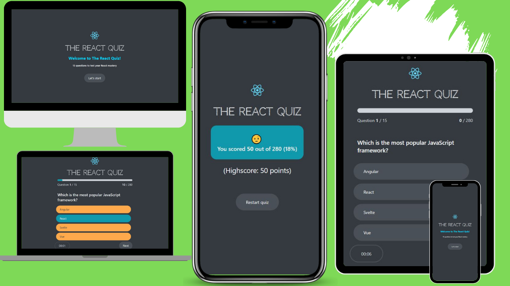

# 🚀 React Quiz App 

The "React Quiz App" is a dynamic and engaging web application built with React.js. This project offers a variety of features, including a complete responsive design for seamless use on different devices, a clean and intuitive user interface, and a timed quiz with a progress bar to track your progress. 

As you answer questions, the app instantly updates your score and provides a comprehensive scorecard once the quiz is completed. The quiz also includes an automatic submission feature when the timer runs out.

# Demo

 [WEBSITE-Demo](https://react-quizapp-sxn2.onrender.com)
 


## 🛠️Technology Used 

- [React.js](https://reactjs.org/)

## 📋Project Features 

- 🌐 Complete Responsive Website: This quiz app is designed to work seamlessly on various devices and screen sizes.
- 🎨 Clean and Simple User Interface: A user-friendly design for an enjoyable quiz experience.
- ⏲️ Timer for Quiz: Each quiz question is timed, adding an element of challenge and excitement.
- 📊 Progress Bar: Keep track of your quiz progress in real-time.
- 📈 Score Update: Instant feedback on your score after answering each question.
- 📜 Score Card: Get a comprehensive scorecard with your quiz results.
- ⏱️ Auto-Submission: The quiz automatically submits when the time is up.
## 📚Learning Points 

- ⚙️ State Management: Explore state management techniques using the `useReducer` hook to efficiently handle application state.
- 🔄 React Hooks: Gain hands-on experience with hooks like `useEffect()` and `useReducer()` for side effects and state management.
- 🧠 Conditional Rendering & Logic: Learn to build interactive UIs with dynamic rendering based on user actions.
- 🕹️ Component-Based Architecture: Understand how to break the UI into reusable and maintainable components.


## How to Install and Run

1. Clone the repository:

    ```powershell
      git clone https://github.com/Ashwastaken78867/React-QUIZ-APP

   
    ```

2. Install dependencies:

    ```bash
    cd React-QUIZ-APP
    npm install
    ```

3. Start the development server:

    ```bash
    npm start
    ```

## 📱Responsiveness 


